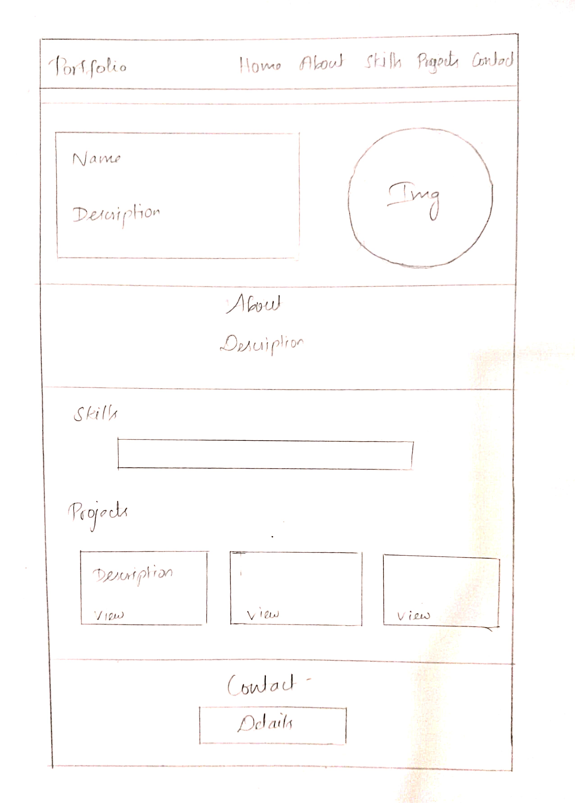
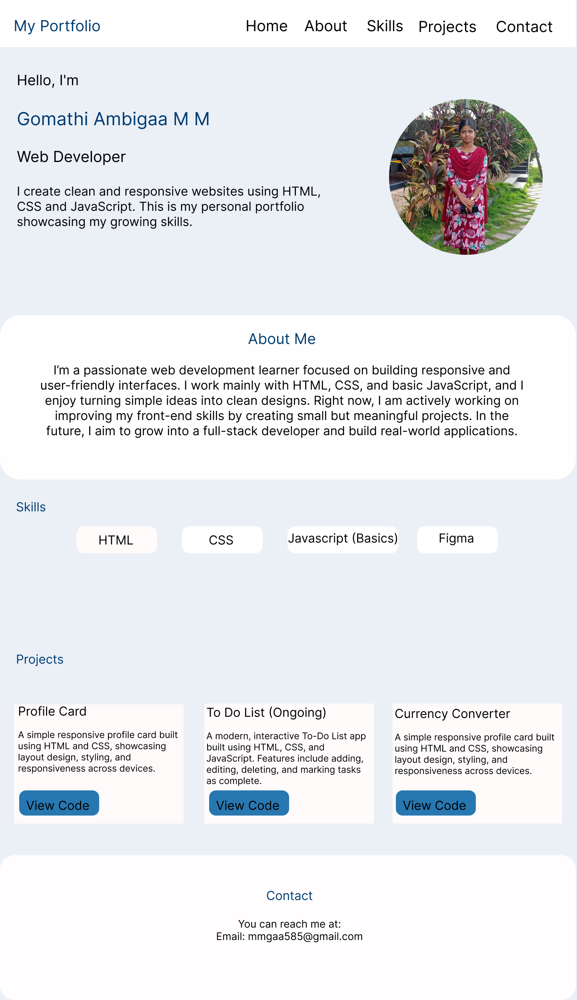

# Personal Portfolio Website

This is my personal portfolio website created using HTML and CSS.  
The site includes sections such as Home, About, Skills, Projects, and Contact.  
It is fully responsive and designed to showcase my work and growing skills in web development.

## Live Demo
https://ambigaa.github.io/portfolio/

## Features
1. Responsive layout  
2. Fixed navigation bar  
3. Projects section with links to GitHub repositories  
4. Contact section with email and social links  

## Wireframe

## UI

## Tech Stack
- HTML  
- CSS  
- Font Awesome Icons  

## How to Run Locally
1. Download the project  
2. Open index.html in a browser  

## Author
Ambigaa  
Portfolio Website – 2025
